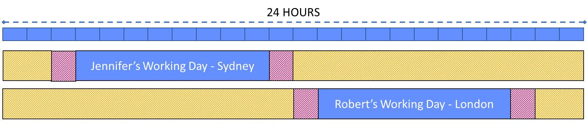
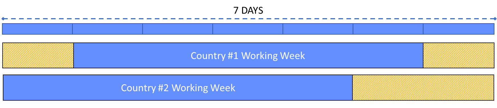

# The Time Zone Tax

The time zone tax refers to the human cost associated with working across time
zones. Like financial taxes, the time zone comes in many forms.

Working across time zones always incurs a tax. Like all taxes they need to be
paid. If you think you are not paying it, someone else is. If no one is paying
it, you are accumulating time zone debt, and as with all debts, it gains
interest.

The time zone tax is not simply doing a late meeting with a different time zone,
or working in a different time zone’s hours. These are the obvious and very
visible taxes that most people are aware of. “It must be late where you are”
statements on calls are an acknowledgement of the tax. But the full cost of the
time zone tax relates to the underlying burden that is paid, the cumulative
result of the visible taxes, and invisible taxes.

While we have many tools to help us understand the time around the world, the
tooling is still not good enough. We still miss meetings because day light
savings just changed, and we still book meetings on someone else’s public
holiday. And we often book meetings unaware of what time zone someone is in.

The observations outlined here are assuming a global team across the widest
possible time zone split. Think more along the lines of Auckland to Los Angeles,
where the time difference heads close to 24 hours. Not all the following will
apply to 4–5-hour time zone shifts, but many of it still will apply. Your
mileage may vary.

-   [Time Zones](#time-zones)

-   [Understanding](#understanding)

    -   [Logistical Taxes](#logistical-taxes)

    -   [Inclusion Taxes](#inclusion-taxes)

-   [Paying Taxes](#paying-taxes)

-   [Logistical Taxes](#logistical-taxes-1)

    -   [Working Hours Tax](#working-hours-tax)

    -   [Working Week Tax](#working-week-tax)

    -   [Day of Week Tax](#day-of-week-tax)

    -   [Shifting Sands Tax](#shifting-sands-tax)

-   [Inclusion Taxes](#inclusion-taxes-1)

    -   [Short Deadline Tax](#short-deadline-tax)

    -   [Late Reminder Tax](#late-reminder-tax)

    -   [Doors Are Open Tax](#doors-are-open-tax)

    -   [Absentee Dialogue Tax](#absentee-dialogue-tax)

    -   [Prime Meridian Tax](#prime-meridian-tax)

    -   [Short Night Tax](#short-night-tax)

    -   [Long Day Tax](#long-day-tax)

    -   [Clarification Tax](#clarification-tax)

    -   [Global Live Event Tax](#global-live-event-tax)

    -   [While You Were Sleeping Tax](#while-you-were-sleeping-tax)

    -   [Obligation Tax](#obligation-tax)

    -   [Date Format Tax](#date-format-tax)

# Time Zones

There are only two types of time zones. Trailing, and leading. Leading time
zones are those often referred to as “ahead” in time. Trailing time zones are
those often referred to as “behind”. For example:

Sydney, Australia is a leading time zone when compared to London, United
Kingdom.

Sydney to los Angeles

London to los Angeles

# Understanding

## Logistical Taxes

Logistical taxes are incurred when there is high awareness of time zone
differences. This tax is unavoidable, but the impact can be mitigated.

A quick example of a logistical tax is two people living in separate time zones
that are 12 hours apart. The time zones are not controlled by the individuals.

## Inclusion Taxes

Inclusion taxes are incurred when there is low awareness of time zone
differences, or little or no effort taken to mitigate the impacts. In many cases
an inclusion tax is mitigated through awareness. In many cases inclusion taxes
can be mitigated completely with deliberate steps to be more inclusive.

# Paying Taxes

The aim is to reduce the tax, but in most cases it cannot be removed completely.
So who ultimately pays the tax? If the aim is for people to no longer pay a
personal tax, how is it being paid?

The answer is simple: The business pays. Deadlines may get pushed back;
approvals may take longer. These are highly visible impacts, and while not
desirable, by doing so the business can be more predictable understanding where
the cost lies in the business and course correct.

| Impact of Personal Tax                                                   | Impact of Business Tax                                  |
|--------------------------------------------------------------------------|---------------------------------------------------------|
| Deadlines get missed, and rescheduled                                    | Deadlines get pushed back ahead of time                 |
| Approvals are rushed, mistakes are made                                  | Approvals take longer                                   |
| People burn out, project output is reduced, project is rescheduled       | Deadlines get pushed back ahead of time                 |
| People quit, creates resource contention                                 | Deadlines get pushed back ahead of time                 |
| The people and business outcomes are unpredictable                       | The people and business outcomes are predictable        |
| The tax is not observable and therefore can not be measured or addressed | The tax is observable and can be measured and addressed |

**Table 1** - Impact of Personal Tax vs Business Tax

Forcing the tax onto team members results in productivity reduction, burnout,
churn, and mistakes. These have a significant business impact, are often
invisible, and as a result make the impact of teams unpredictable. The tax has
to be paid, the business is still impacted – productivity reduces, teams miss
deadlines, quality reduces, and general team health all have huge business
impacts. And there are additional compounding impacts. By design this creates a
business environment for people to be irritable, unreliable, and to resign. It
models that non-inclusive behaviour is desirable and acceptable to the business.

By moving the tax onto the business, it creates a forcing function for processes
and procedures to change, tools change, and people change, all to be more
inclusive, and stay sustainably and reliably productive.

# Logistical Taxes

## Working Hours Tax

The time zone tax that most people are aware of is the working hours tax. People
in different time zones, work at different times. But the working hours tax can
be caused by more than time zones.

Working hours may vary for many reasons, including variation across time zones,
and adjusted local working hours.

Nominal working hours in different time zones result in people working at
different times.

>   Example: Jennifer starts work at 9am in Sydney. Her teammate Robert Is in
>   London and starts work at 9am in London, which is in 10 hours. Their working
>   day does not overlap.  
>     
>   **Figure 1** Working Hours Shift Due To Time Zones

Some employees have adjusted local working hours, often due to regular external
commitments, including but not limited to medical and family commitments.

>   Example: David works an agreed 5am – 3pm schedule every day due to family
>   commitments.  
>   ****  
>   **Figure 2** Individual Working Hours Shift To Local Hours

### Approach

TBD

## Working Week Tax

The working week tax relates to the fact that not all teams have the same
working week. There are many reasons for this.

We live in a diverse planet with cultures that observe different working weeks,
regardless of time zone. Israel for example, has a Sunday to Thursday working
week.

>   Example: Rachel lives in Israel, where her working week is Sunday to
>   Thursday. Laurent, who lives in Paris, has a working week from Monday to
>   Friday. Their working week overlaps for 4 days.  
>     
>   **Figure 3** Working Week Shifted in Same Time Zone

Similarly, people may work part time (permanently, or temporarily) and take
leave for certain days of the week. This usually is either a Monday or Friday
which causes a similar impact to the above. However, when the day of absence is
mid-week this can cause impacts caused by assumptions that the individual is
working the full week.

>   PLACEHOLDER  
>   Example: Rachel lives in Israel, where her working week is Sunday to
>   Thursday. Laurent, who lives in Paris, has a working week from Monday to
>   Friday. Their working week overlaps for 4 days.  
>     
>   **Figure 3** Working Week Shifted in Same Time Zone

Due to the international dateline, Monday in Auckland, is Sunday in Los Angeles.
This means that there is 4 days of overlap during the working week on a time
zone basis.

>   PLACEHOLDER  
>   Example: Rachel lives in Israel, where her working week is Sunday to
>   Thursday. Laurent, who lives in Paris, has a working week from Monday to
>   Friday. Their working week overlaps for 4 days.  
>     
>   **Figure 3** Working Week Shifted in Same Time Zone

### Approach

Clear Mondays and Fridays for global rhythm of business interaction activities.
A good rule is to work on a Tuesday to Thursday basis for heavy global
interaction. How do you select the working week? For what time zone do you
select Tuesday to Thursday? Los Angeles? Auckland? Paris? The magic here is that
it does not matter. This habit ensures you will never book something on
someone’s Sunday by mistake.

## Day of Week Tax

When working with teams around the world, assume there is zero overlap where the
day of the week is the same. A team in Japan shares no working day with a team
in Los Angeles. As such, if someone is saying “hold for Monday” in one location,
that will not be Monday in the other location.

>   PLACEHOLDER  
>   Example: Rachel lives in Israel, where her working week is Sunday to
>   Thursday. Laurent, who lives in Paris, has a working week from Monday to
>   Friday. Their working week overlaps for 4 days.  
>     
>   **Figure 3** Working Week Shifted in Same Time Zone

Similarly, placeholders in calendars for days i.e. “HOLD FOR CUSTOMER MEETING TO
BE SCHEDULED” are guaranteed to be wrong, and will result in the opposite of the
intended affect. Full day event placeholders are useful for marking your own
availability, or a national holiday, but should be avoided when applied to
others outside your time zone.

>   PLACEHOLDER  
>   Example: Rachel lives in Israel, where her working week is Sunday to
>   Thursday. Laurent, who lives in Paris, has a working week from Monday to
>   Friday. Their working week overlaps for 4 days.  
>     
>   **Figure 3** Working Week Shifted in Same Time Zone

### Approach

Block the hours in the calendar instead, 8 hours, 12 hours, 24 hours… this will
then adjust for the day automatically due to adjusting to time zone.

Similarly, there is no point declaring “Friday a no meeting day” for all unless
trailing time zones observe this on a Thursday.

## Shifting Sands Tax

A broadly known but rarely remembered fact: Time zones change throughout the
year. In fact, for more than 1/6 of the year, time zones are changing.

>   PLACEHOLDER   
>     
>   **Figure 3** Show time of year that time zones are changing

Day light savings is observed across many countries and can vary by state,
resulting in a meeting at 8am, to now be at 6am without anything being
rescheduled. This does not impact the scheduler directly, as the meeting will
still be at their original time. It does however impact the scheduler indirectly
since attendees may miss meetings or decline.

>   PLACEHOLDER  
>   Example: State by state might not be needed   
>     
>   **Figure 3** Working Week Shifted in Same Time Zone

Daylight rolls out across various countries over approximately a one-month
period. Throughout the month when time zone changes happen (twice per year),
like shifting sands, the meetings start to move through calendars. The only way
to handle this is to put forethought into how this impacts everyone on the
meeting, communicate, and adjust accordingly. Since times for meetings may need
to be rescheduled significantly, these can be good months to reduce meetings
while they are rescheduled.

>   PLACEHOLDER  
>   Example: Over the month how calendars will look week by week  
>     
>   **Figure 3** Working Week Shifted in Same Time Zone

# Inclusion Taxes

## Short Deadline Tax

Creating deadlines based on days with short notice can result in a considerable
difference across time zones. If today is Tuesday in a trailing time zone, a
Friday deadline is 3 days away, in a leading time zone it is 2 days away. This
is a 50% difference in terms of time provided to people to deliver.

>   PLACEHOLDER  
>   Example: Over the month how calendars will look week by week  
>     
>   **Figure 3** Working Week Shifted in Same Time Zone

## Late Reminder Tax

Reminding people of deadlines from a trailing time zone when it is already too
late for those in leading time zones. Similar to the short deadline tax, a
Friday morning reminder for a Friday COB deadline in a trailing time zone, is
likely past the deadline in a leading time zone.

>   PLACEHOLDER  
>   Example: Over the month how calendars will look week by week  
>     
>   **Figure 3** Working Week Shifted in Same Time Zone

## Doors Are Open Tax

This happens when there is limited allocation for an opportunity, for example
“register quick, spots are limited!!”. The time zone of the announcement
benefits more than others as they can respond immediately.

While this can occur in any time zone, leading or trailing. There are two common
ways to increase the impact of this. One way is to “open doors” on a Monday
morning in the leading time zone (\~24-hour impact to trailing time zone). The
highest impact scenario is to “open doors” on Friday in a trailing time zone
(\~48-hour impact to the leading time zone).

>   PLACEHOLDER  
>   Example: Over the month how calendars will look week by week  
>     
>   **Figure 3** Working Week Shifted in Same Time Zone

### Approach

Reserve spots for each region. Release them if not registered.

## Absentee Dialogue Tax

Assuming consensus after a long discussion, when others outside the time zone
are yet able to contribute. Decisions are therefore made without any time zone
considerations, and not all perspectives were sought.

In addition, often these discussions happen in forums that will no longer be at
the top of the inbox/collaboration tool for the other time zones when they come
online.

## Prime Meridian Tax

The prime meridian is an imaginary line that splits the world vertically to
create two equal vertical hemispheres, often referred to as the East and West.
For globally spread teams, this is commonly used to create two “inclusive” zones
for global meetings and rhythms. This assumes a work cycle of 12 hours. The team
members at the edges of the zones will routinely be pay a much higher tax by
design.

>   PLACEHOLDER  
>   Example: Over the month how calendars will look week by week  
>     
>   **Figure 3** Working Week Shifted in Same Time Zone

### Approach

Have 3 x 8-hour time zones for regular global rhythms, with minimal overlap, and
make sure they cover the planet.

## Short Night Tax

Having commitments to do a meeting late, while having commitments to do an early
meeting the following day. This results in lack of sleep, and inability to focus
in the second meeting.

We do not get the best out of people when we burn the candle at both ends, and
when we do this by design, we are intentionally burning our people out and
willingly creating an environment for poor performance.

>   PLACEHOLDER  
>   Example: Over the month how calendars will look week by week  
>     
>   **Figure 3** Working Week Shifted in Same Time Zone

## Long Day Tax

Having commitments to do an early meeting, while having commitment to do a late
meeting on the same day, creating an extra-long day. This results in mental
exhaustion, and inability to focus in the second meeting.

Stretching team members thin does not allow them to do their best work, and
exhausted workers make mistakes.

>   PLACEHOLDER  
>   Example: Over the month how calendars will look week by week  
>     
>   **Figure 3** Working Week Shifted in Same Time Zone

## Clarification Tax

Someone schedules a meeting in someone else’s calendar. Unable to accept the
request, the recipient context switches from their current activity, to explain
that the meeting was scheduled at 3am their time and suggests an appropriate
time.

This sounds minor, but context switching has a high cost. It impacts
productivity by 20-40%, and with deep thinking the impact is even high to get
back into a flow state. That tax is not paid by the sender, and is paid by the
recipients outside the sender’s time zone.

>   PLACEHOLDER  
>   Example: Over the month how calendars will look week by week  
>     
>   **Figure 3** Working Week Shifted in Same Time Zone

## Global Live Event Tax

For truly global activities, start them on the same day and roll them around the
world. Have recordings that people can re-watch in their own time, and schedule
group viewing meetings.

>   PLACEHOLDER  
>   Example: Over the month how calendars will look week by week  
>     
>   **Figure 3** Working Week Shifted in Same Time Zone

Avoid scheduling a 5-day live event for everyone, as a maximum 4 days can be
inclusive of most people.

## While You Were Sleeping Tax

Someone gets up early to join a meeting, only find it was cancelled while they
were sleeping.

>   PLACEHOLDER  
>   Example: Over the month how calendars will look week by week  
>     
>   **Figure 3** Working Week Shifted in Same Time Zone

## Obligation Tax

Making someone obliged to do a meeting out of time zone simply because others
have done this. Often a mitigation strategy, sharing can stop people from
burning out or breaking, but this simply distributes the tax across an entire
team. The aim should be to reduce the time zone tax, not force it on others.

>   PLACEHOLDER  
>   Example: Over the month how calendars will look week by week  
>     
>   **Figure 3** Working Week Shifted in Same Time Zone

### Approach

Rather than shifting the time zone tax, consider shifting the meeting times and
not having participants obligated to attend. Enforce this where possible, and do
not invite them. They can provide input ahead of time, listen to recordings,
read minutes, and take action in their own time zone. These are all activities
that would have happened regardless, and are now in the right time zone.

## Date Format Tax

This is more in relation to how time and date is defined between countries, but
as a side effect it often impacts scheduling across time zones. It occurs when
there is confusion between the date formats MM DD YYYY and DD MM YYYY when
interpreting or proposing dates in writing. This is compounded more when MM/DD
is written as a shorthand, i.e. 5/6.

| Who       | Written Communication                             | Impact                                                                                        |
|-----------|---------------------------------------------------|-----------------------------------------------------------------------------------------------|
| Sender    | I will schedule the meeting in Seattle on **5/6** | None. Book meeting rooms mid may for meeting to take place on **5th of June**.                |
| Recipient | I will schedule the meeting in Seattle on **5/6** | Book flights to fly to Seattle and turn up on the **6th of May**, meeting is not for a month. |

### Approach

Use calendar proposal tools for proposing dates for meetings, events, etc. This
also ensures the data and time are defined explicitly.

When writing/creating written dates avoid using numerical months.

| Numerical  | Literal     |
|------------|-------------|
| 01.10.2020 | 10 Jan 2020 |
| 10.01.2020 | Jan 10 2020 |

When reading/interpreting written date formats, ask for clarification before
assuming if they are in numerical format. This is a far cheaper tax to pay than
getting the dates wrong.
